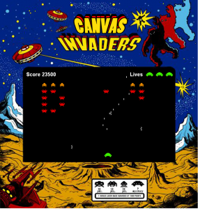

\[caption id="attachment\_38" align="alignleft" width="284" caption="Canvas Invaders"\]\[/caption\]

[space invaders clone](http://www.somethinghitme.com/projects/canvasinvaders/ "Canvas Invaders")

I've been hearing things about this [canvas](https://developer.mozilla.org/En/Canvas_tutorial "canvas tutorials") element lately and I found some really cool uses. Mostly I found examples of charts that use it, which makes sense because in some browsers its not very fast rendering real time elements onto it, and IE browsers do not natively support it. After doing some more research and seeing as its in the HTML 5 specification I figured I would try my hand at making something quick with it. So I decided to create a quick [space invaders clone](http://www.somethinghitme.com/projects/canvasinvaders/ "Canvas Invaders"). For the rendering base code I used some code which shows pretty nice looking particle engine using canvas at [iterationsix.com](http://iterationsix.com/particle_fountain/particle_fountain.html). If you want the canvas invader files you can get them [here](http://www.somethinghitme.com/wp-content/uploads/2009/03/canvas-invaders.zip "Canvas sources ")

After completing this it really excites me the direction Javascript seems to be going. I definitely think one day in the distant future it will be able to replace Flash for most anything. Especially if browsers continue to implement faster JS engines, and MS really does ditch its IE platform.

For some good tutorials on using canvas check this site out, its has some  useful information.

[https://developer.mozilla.org/En/Canvas\_tutorial](https://developer.mozilla.org/En/Canvas_tutorial)
