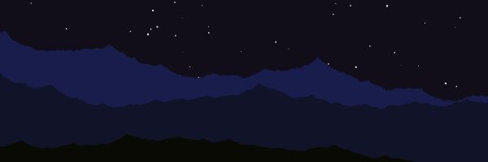
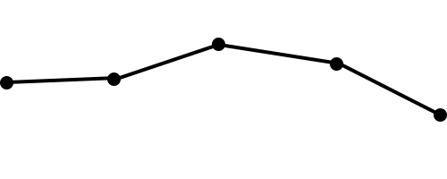
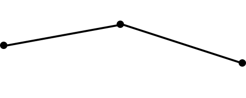
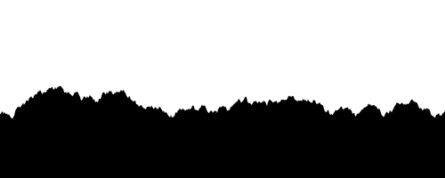

[](http://codepen.io/loktar00/details/uEJKl)
<p align="center">
Screenshot from scrolling terrain and shooting stars demo on codepen.io
</p>

In a few of my demos I've used 2d terrain. I love the effect and its really easy to do especially in 2d. The algorithm I use most is Diamond Square also known as Midpoint Displacement. What's great about the algorithm besides its easy of use is that it can be used for simple 2d terrain as well as with 3d terrain. For now I will just be talking about generating 2d terrain, in a future article I will discuss how to use the same algorithm to make create height maps that can be used in turn to create 3d terrain.

Im going to use JavaScript and the canvas element for my examples but the principles can easily be applied to any language or rendering technology.

The method I will be describing is midpoint displacement. Its one of the simplest algorithms in my opinion when it comes to making good looking 2d procedural terrain.

## A Brief Overview of How it Works

For Each Segment
    Divide in half and average the middle point
        add a random value to the mid point
        reduce the random range
    Repeat Until segments are too small to continue.

## A More in Depth Explanation

First we assign a random value to the outer edges of our terrain. This can be anything from 0-1 or 50-100. The value itself is dependant on the system you want to use for plotting. We then need to get the center point of the segment. Once we have the center we calculate its value by averaging the two points and adding a random value to it.

 [](http://www.somethinghitme.com/wp-content/uploads/2013/11/fig1.png)

So now that we have our 3 starting points we move onto the next step. The next step is exactly the same as above. As you can see we have 2 segments, so we get the center of each segment and add the average of its edges plus a random amount. We then need reduce our random range for the next iteration.

 [](http://www.somethinghitme.com/wp-content/uploads/2013/11/fig2.png)

Now we have four segments so all we need to do is cut each segment in half again, average the center values add our random value and reduce the random range.

 [](http://www.somethinghitme.com/wp-content/uploads/2013/11/fig3.png)

As you can see the more iterations creates more realistic terrain. Lately it seems like none of my articles can be complete without an animated gif, so here is one animating the process.

 [](http://www.somethinghitme.com/wp-content/uploads/2013/11/output_WRacb0.gif)

## How much do I reduce the random range?

From now on I’ll call this roughness. How much do you need to reduce it by each iteration? Well that all depends on how you want your end result to look. The greater the reduction the less jagged your hill’s will be. So if you want more of a rolling hill appearance you would to reduce the value at least by half every iteration, however if you want more jagged mountains you don’t want to reduce the value very much at all. Below is an example of terrain using two different values for roughness.

\[caption id="attachment\_779" align="aligncenter" width="500"\][](http://www.somethinghitme.com/wp-content/uploads/2013/11/point5.png) Created by using a value of 0.5\[/caption\]

\[caption id="attachment\_780" align="aligncenter" width="500"\][](http://www.somethinghitme.com/wp-content/uploads/2013/11/point7.png) Created by using a value of 0.7\[/caption\]

The following JavaScript function is what I used to create the above examples.

```javascript
/*
  width and height are the overall width and height we have to work with, displace is
  the maximum deviation value. This stops the terrain from going out of bounds if we choose
*/

function terrain(width, height, displace, roughness){
    var points = [],
        // Gives us a power of 2 based on our width
        power = Math.pow(2, Math.ceil(Math.log(width) / (Math.log(2))));

    // Set the initial left point
    points[0] = height/2 + (Math.random()*displace*2) - displace;
    // set the initial right point
    points[power] = height/2 + (Math.random()*displace*2) - displace;
    displace *= roughness;

    // Increase the number of segments
    for(var i = 1; i < power; i *=2){
        // Iterate through each segment calculating the center point
        for(var j = (power/i)/2; j < power; j+= power/i){
            points[j] = ((points[j - (power / i) / 2] + points[j + (power / i) / 2]) / 2);
            points[j] += (Math.random()*displace*2) - displace
        }
        // reduce our random range
        displace *= roughness;
    }
    return points;
```

<iframe style="width: 540px; height: 300px;" src="https://jsfiddle.net/loktar/5Xdzg/embedded/result,js,html,css/" height="240" width="320" frameborder="0"></iframe>

In my code I also use a value called displace. This is just to control the maximum distance a point can go this is so II can keep it inside of the canvas area.

## Wrapping Terrain and Scrolling

Using this algorithm makes it easy to create wrapping terrain, in order to do so you just set the two initial starting points to the same value.

There are a few ways to create scrolling terrain. In my codepen for example I cheat and just pop and push the points on the array itself which makes the wrapped terrain scroll. However a better approach in my opinion is to use two sets of values and just move them based on an offset. Once the second half reaches the edge of the screen reset the offset to 0 copy the second array to the first, and generate new terrain for the second array, passing in the seed. Below is a fiddle of how I personally achieve the effect.

<iframe style="width: 540px; height: 300px;" src="https://jsfiddle.net/loktar/XDpd3/embedded/result,js,html,css/" height="240" width="320" frameborder="0"></iframe>

Well that was a lot of information. Would you believe there is an even simpler method to creating 2d terrain than that? I'll go over that in my next article.
